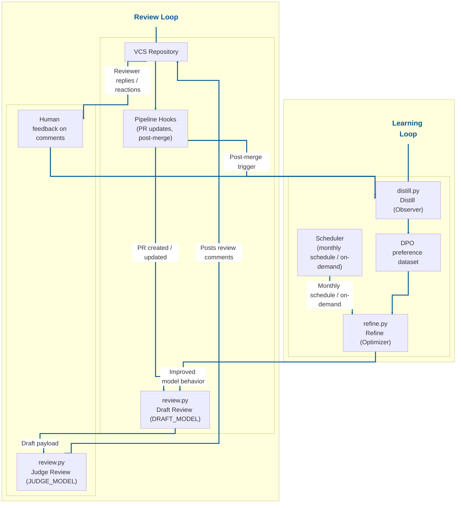

# Reflex Reviewer

Reflex Reviewer is an **automated AI code review** system for pull requests (PRs), designed with a pluggable VCS integration layer.

> **VCS support status:** Reflex Reviewer currently supports **Bitbucket Data Center only**.  
> **GitHub support is the next target** and is not available yet.

It runs as a self-improving loop:
- review PRs,
- collect human feedback on review comments,
- refine behavior monthly or on-demand with DPO-based training signals.

Reflex Reviewer is an **agentic ecosystem** with three collaborating flows: review (actuator), distill (observer), and refine (optimizer).

## For the Nomenclature Nuts

Reflex Reviewer is named after the **Reflexion AI pattern**—an architecture where an agent evaluates outcomes and improves over time.

The name reflects a **Sense-Think-Act** cycle: continuous improvement that gets sharper with repeated feedback.

It's called **Reflex** because, like a ***human reflex***, the improvement is automatic, integrated, and gets sharper with every interaction.

## Table of Contents

- [Reflex Reviewer](#reflex-reviewer)
  - [For the Nomenclature Nuts](#for-the-nomenclature-nuts)
  - [Table of Contents](#table-of-contents)
  - [1) How it works (end-to-end)](#1-how-it-works-end-to-end)
    - [Architecture diagram](#architecture-diagram)
    - [Refinement (DPO)](#refinement-dpo)
  - [2) Reliability and retry strategy](#2-reliability-and-retry-strategy)
    - [`reflex_reviewer/vcs/bitbucket_data_center.py`](#reflex_reviewervcsbitbucket_data_centerpy)
    - [`reflex_reviewer/llm_api_client.py`](#reflex_reviewerllm_api_clientpy)
  - [5) Runtime configuration (CLI)](#5-runtime-configuration-cli)
  - [6) VCS pipeline steps](#6-vcs-pipeline-steps)
    - [Build Pipeline step scripts (repository-committed)](#build-pipeline-step-scripts-repository-committed)
    - [Best-practice Build Pipeline step architecture](#best-practice-build-pipeline-step-architecture)
  - [7) Package-first usage (PyPI-ready)](#7-package-first-usage-pypi-ready)
    - [Install from TestPyPI](#install-from-testpypi)
    - [Publish to TestPyPI with Twine](#publish-to-testpypi-with-twine)
  - [8) Local run examples](#8-local-run-examples)
  - [9) Reuse from another repository](#9-reuse-from-another-repository)
  - [10) Notes / limitations](#10-notes--limitations)
  - [11) Future improvements](#11-future-improvements)

## 1) How it works (end-to-end)

### Architecture diagram



1. **Actuation / PR Review (`reflex_reviewer/review.py`)**
   - Fetches PR diff + metadata from configured VCS provider
   - Fetches paginated PR activities/comments and builds root-comment context (human + bot) to reduce repetitive suggestions
   - Converts JSON diff to unified diff text, skips noisy files, truncates oversized diffs
     - **Unified diff (short note):** Git-style patch text where `---`/`+++` are file headers, `@@ -a,b +c,d @@` is a hunk header, and line prefixes mean removed (`-`), added (`+`), or context (` `).
     - **Incoming JSON diff shape (short note):** high-level structure is `diffs -> hunks -> segments -> lines` (for example: each diff has `source`/`destination`, each hunk has line spans, each segment has a `type` like `ADDED|REMOVED|CONTEXT`, and each segment contains line entries).
   - Runs two-stage review inference:
     - `DRAFT_MODEL` (broad issue finder / high-recall pass):
       - analyzes diff + PR context and proposes initial findings,
       - returns a draft structured payload (`verdict`, `summary`, `checklist`, `comments`),
       - may include low-quality or duplicate findings that still need curation.
     - `JUDGE_MODEL` (quality gate / precision pass):
       - reviews the draft payload against the same PR context,
       - keeps comments only when supported by provided evidence (diff/PR context/existing root comments),
       - removes unsupported or hallucinated findings when evidence is insufficient,
       - filters out vague/duplicate/non-actionable/speculative comments,
       - rewrites retained comments to be concise and actionable,
       - rewrites summary/checklist to match retained comments,
       - preserves valid `anchor_id` usage and allowed severity taxonomy in final output.
   - Parses structured output (`verdict`, `summary`, `checklist`, `comments`)
   - Normalizes inline comment severities to the supported taxonomy: `CRITICAL`, `MAJOR`, `ADVISORY`
   - Enforces `ADVISORY` severity for comments anchored to test files (for example under `tests/`, `test_*.py`, `*_test.py`)
   - For responses API mode, uses configured `stream_response`; persists and reuses `previous_response_id` by PR context for the draft stage response when a response id is available
   - Posts a new summary comment for every review run (append-only; existing summary comments are preserved)
   - Relies on model/judge instructions plus existing root comments (human + bot; replies excluded) to avoid semantically duplicate findings
   - Keeps posting path simple: no code-side rerun dedupe against existing inline comments
   - Posts optional inline comments back to VCS

2. **Distillation / Feedback Collection (`reflex_reviewer/distill.py`)**
   - Reads paginated PR activities and builds root comment threads
   - Excludes all review summary comments from sentiment classification and DPO pair extraction (supports both legacy summary shape and explicit summary marker)
   - Ranks threads by reply count and selects top configured threads
   - Preserves normalized bot-comment severity in batched sentiment payloads (`CRITICAL|MAJOR|ADVISORY`) with test-file comments coerced to `ADVISORY`
   - Runs one batched LLM API classification pass per selected threads (`ACCEPTED`, `REJECTED`, `UNSURE`) using configured `stream_response`
   - Appends only high-confidence preference samples (`ACCEPTED` / `REJECTED`) to the DPO dataset

3. **Refinement / Training (`reflex_reviewer/refine.py`)**
   - Loads DPO dataset and validates minimum sample threshold
   - Splits into train/validation sets (`train.jsonl`, `val.jsonl`) under `--dpo-training-data-dir` and starts DPO fine-tuning
   - Polls fine-tune job until terminal state
   - Clears temp cache only on successful completion

### Refinement (DPO)

**What is DPO?**

Direct Preference Optimization (DPO) is a preference-learning method that trains a model from ranked pairs (chosen vs. rejected responses), without requiring a separate reward model or a full RL optimization loop.

**Why is DPO preferred here?**

- It maps directly to Reflex Reviewer’s distilled feedback signals (`ACCEPTED` vs `REJECTED`).
- It is operationally simpler than RLHF-style training pipelines, which makes monthly/on-demand refinement easier to maintain.
- It provides targeted behavior updates from reviewer preferences while preserving the base model’s general capabilities.

**Compatibility note**

For refine/fine-tuning workflows, ensure your selected model/backend supports both fine-tuning endpoints and file upload endpoints.

---

## 2) Reliability and retry strategy

Both VCS and LLM API HTTP paths use `tenacity` with the same retry policy:

- `wait=wait_exponential(multiplier=1, min=2, max=20)`
- `stop=stop_after_attempt(3)`
- `retry=retry_if_exception_type(requests.exceptions.RequestException)`
- `reraise=True`

### `reflex_reviewer/vcs/bitbucket_data_center.py`

Retry-wrapped request helpers:
- `_get_with_retry(...)`
- `_post_with_retry(...)`
- `_put_with_retry(...)`

These cover Bitbucket operations such as:
- fetching PR diff,
- fetching PR metadata,
- paginated PR activity fetch,
- posting review comments,
- updating comments.

### `reflex_reviewer/llm_api_client.py`

Retry-wrapped request helpers:
- `_post_with_retry(...)`
- `_get_with_retry(...)`

These cover LLM API operations such as:
- chat completions,
- responses API calls,
- file upload,
- fine-tune job creation,
- fine-tune status retrieval.

After retries are exhausted, request exceptions propagate to callers; response parsing failures are surfaced explicitly (`LLMAPIResponseParseError`) so callers can handle them separately.

---

## 5) Runtime configuration (CLI)

Use CLI arguments for runtime behavior. Core commands:

- `python3 -m reflex_reviewer.review`
- `python3 -m reflex_reviewer.distill`
- `python3 -m reflex_reviewer.refine`

Required CLI arguments:
- `--team-name` (all commands)
- `--dpo-training-data-dir` (required for `distill` and `refine`)

`--dpo-training-data-dir` is the parent directory for DPO datasets. The effective JSONL file is derived per team as:
- `<dpo_training_data_dir>/{sanitized_team_name}_dpo_training_data.jsonl`

Where `sanitized_team_name` is generated from `--team-name` by:
- lowercasing the team name,
- replacing non-alphanumeric separators with `_` (for example, `TEAM-DEV` → `team_dev`).

Model/runtime values can be set in `reflex_reviewer.toml` under `[model]`:
- `draft_model` (review flow: generates initial draft review payload)
- `judge_model` (review flow: verifies evidence, removes unsupported/hallucinated findings, then curates final payload)
- `stream_response`
- `model_endpoint` (`chat_completions` default, or `responses` if your org/backend supports stateful `previous_response_id` flows)
- `reasoning_effort`

CLI can still override model values when needed:
- `--draft-model`
- `--judge-model` (review flow)
- `--stream-response`

Common optional CLI arguments:
- `--pr-id` (review/distill)
- `--vcs-type` (review/distill)
- runtime override flags for VCS and LLM API endpoints/credentials (for example: `--vcs-base-url`, `--llm-api-base-url`, `--llm-api-key`)

LLM API timeout configuration:
- `llm_api.read_timeout_seconds` in `reflex_reviewer.toml` controls LLM API socket read timeout (default `30`).
- `LLM_API_READ_TIMEOUT_SECONDS` can override the TOML value at runtime.

LLM API auth behavior:
- If `LLM_API_KEY` (or CLI `--llm-api-key`) is set, LLM API requests use that API key.
- If no API key is provided, LLM API requests fall back to OAuth2 token auth.
- CLI `--llm-api-key` takes precedence over env/TOML configuration.

For all environment variables, default values, and env interpolation behavior, refer to **`reflex_reviewer.toml`**.

---

## 6) VCS pipeline steps

Reflex Reviewer is designed around three generic pipeline step trigger types:

1. **PR create/update pipeline step**
   - Runs review flow:
   - `python3 -m reflex_reviewer.review --team-name "<TEAM_NAME>" --draft-model "<DRAFT_MODEL>" --judge-model "<JUDGE_MODEL>"`

2. **Post-merge pipeline step (target branch updates)**
   - Runs distill flow:
   - `python3 -m reflex_reviewer.distill --team-name "<TEAM_NAME>" --draft-model "<DRAFT_MODEL>" --dpo-training-data-dir "<TRAINING_DATA_DIR>"`

3. **Monthly/on-demand pipeline step**
   - Runs refine flow:
   - `python3 -m reflex_reviewer.refine --team-name "<TEAM_NAME>" --draft-model "<DRAFT_MODEL>" --dpo-training-data-dir "<TRAINING_DATA_DIR>"`

### Build Pipeline step scripts (repository-committed)

Commit these scripts in your repository and invoke them from build pipeline steps.

This repository includes Build Pipeline-oriented shell wrappers under:

- `scripts/build-pipeline/review-step.sh`
- `scripts/build-pipeline/distill-step.sh`
- `scripts/build-pipeline/refine-step.sh`

Shared helper:

- `scripts/build-pipeline/common.sh`

Runtime bootstrap utility:

- `scripts/build-pipeline/setup-pipeline-runtime.sh`

What each script runs:

- `review-step.sh` → `python3 -m reflex_reviewer.review ... --pr-id <PR_ID>`
- `distill-step.sh` → `python3 -m reflex_reviewer.distill ... --pr-id <PR_ID> --dpo-training-data-dir <DIR>`
- `refine-step.sh` → `python3 -m reflex_reviewer.refine ... --dpo-training-data-dir <DIR>`

PR id resolution (`review-step.sh` and `distill-step.sh`) follows this order:

1. first positional argument
2. `PR_ID`
3. `VCS_PR_ID`
4. `BITBUCKET_PR_ID`
5. `BITBUCKET_PULL_REQUEST_ID`
6. `PULL_REQUEST_ID`

Required environment variables:

- `TEAM_NAME`
- `DRAFT_MODEL` (required by all flows; in review it generates the draft payload)
- `JUDGE_MODEL` (required by `review-step.sh`; verifies evidence and finalizes draft into review payload)
- `LLM_API_BASE_URL`
- `VCS_BASE_URL`
- `VCS_PROJECT_KEY`
- `VCS_REPO_SLUG`
- `VCS_TOKEN`
- `DPO_TRAINING_DATA_DIR` (required by `distill-step.sh` and `refine-step.sh`)

LLM API auth configuration (choose one):

- `LLM_API_KEY`, or
- `OAUTH2_TOKEN_URL` + `OAUTH2_USER_ID` + `OAUTH2_USER_SECRET`

Required for setup step only:

- `RR_REPOSITORY_CLONE_URL` (only when `RR_PIPELINE_INSTALL_MODE=clone`)

Optional:

- `LLM_API_PROXY_URL` (optional proxy for outbound LLM API calls)
- `RR_PIPELINE_INSTALL_MODE` (`package` default, or `clone`)
- `RR_PACKAGE_INSTALL_TARGET` (pip install target used in package mode; default `reflex-reviewer`)
- `RR_PACKAGE_INDEX_URL` (package mode primary pip index URL; default `https://test.pypi.org/simple/`)
- `RR_PACKAGE_EXTRA_INDEX_URL` (package mode extra pip index URL; default `https://pypi.org/simple/`; leave empty to disable)
- `RR_REPOSITORY_DIR` (clone mode prepared checkout dir; defaults to `<cwd>/.reflex-reviewer-clone`)
- `RR_REPOSITORY_REF` (optional branch/tag for clone mode via `git clone --branch`)
- `PYTHON_BIN` (optional explicit interpreter override)
- `RR_VENV_DIR` (optional explicit venv-dir override; resolved as `<RR_VENV_DIR>/bin/python`)
- Default runtime without overrides:
  - package mode: `<cwd>/.reflex-reviewer-venv/bin/python`
  - clone mode: `<repo>/.venv/bin/python`

Build Pipeline setup behavior:

- `setup-pipeline-runtime.sh` supports two runtime modes:
  - `package` mode (default): creates/uses venv and installs `RR_PACKAGE_INSTALL_TARGET` with pip using:
    - `RR_PACKAGE_INDEX_URL` (default `https://test.pypi.org/simple/`),
    - `RR_PACKAGE_EXTRA_INDEX_URL` (default `https://pypi.org/simple/`, optional).
  - `clone` mode: performs fresh clone, then installs dependencies from cloned `requirements.txt`.
- Step scripts (`review-step.sh`, `distill-step.sh`, `refine-step.sh`) do not clone.
- In `clone` mode, step scripts require prepared checkout/runtime and fail fast if missing.

Runtime bootstrap for pipeline runner hosts:

```bash
# Default package mode: install runtime package in venv
./scripts/build-pipeline/setup-pipeline-runtime.sh

# Package mode with explicit pinned target
RR_PACKAGE_INSTALL_TARGET="reflex-reviewer==0.1.3" ./scripts/build-pipeline/setup-pipeline-runtime.sh

# Package mode with explicit package indexes
RR_PACKAGE_INDEX_URL="https://test.pypi.org/simple/" \
RR_PACKAGE_EXTRA_INDEX_URL="https://pypi.org/simple/" \
./scripts/build-pipeline/setup-pipeline-runtime.sh

# Clone mode (requires clone URL)
RR_PIPELINE_INSTALL_MODE=clone RR_REPOSITORY_CLONE_URL="<REPO_CLONE_URL>" ./scripts/build-pipeline/setup-pipeline-runtime.sh

# Optional custom venv location
./scripts/build-pipeline/setup-pipeline-runtime.sh --venv-dir /opt/reflex-reviewer/venv
```

What setup validates:

- Python 3.9+
- importability of runtime modules (`openai`, `requests`, `tenacity`, `dotenv`, `authlib`)
- `reflex_reviewer` package import from selected runtime

Each pipeline step script performs fail-fast checks before execution:

- repository layout checks (`requirements.txt`, `reflex_reviewer/`) in clone mode only
- runtime import checks for required Python modules
- data directory creation/writability checks for distill/refine

Example invocations:

```bash
# setup first (default package mode)
./scripts/build-pipeline/setup-pipeline-runtime.sh

# PR event pipeline step
./scripts/build-pipeline/review-step.sh 123

# Post-merge pipeline step
DPO_TRAINING_DATA_DIR=data ./scripts/build-pipeline/distill-step.sh 123

# Monthly/on-demand refine pipeline step
DPO_TRAINING_DATA_DIR=data ./scripts/build-pipeline/refine-step.sh

# Clone-mode step examples
RR_PIPELINE_INSTALL_MODE=clone RR_REPOSITORY_DIR="<PREPARED_REPO_DIR>" ./scripts/build-pipeline/review-step.sh 123
```

### Best-practice Build Pipeline step architecture

To preserve Reflex Reviewer’s intended learning loop (`review -> distill -> refine`), wire pipeline steps in this order:

| Bitbucket trigger timing | Script | Why this is the intended architecture |
| --- | --- | --- |
| PR created / PR updated | `review-step.sh` | Review comments are most useful during active PR discussion. |
| PR merged / target branch updated post-merge | `distill-step.sh` | Distill should run after reviewer replies exist, so preference extraction has signal. |
| Monthly admin schedule or on-demand execution | `refine-step.sh` | Refinement should be decoupled from PR latency and run on accumulated datasets. |

Recommended operational setup:

1. Run `setup-pipeline-runtime.sh` first to prepare runtime (package mode by default; clone mode when explicitly enabled).
2. Keep runtime credentials in secure environment variables, not inline in pipeline config.
3. Ensure PR events pass a PR id explicitly if your pipeline trigger context does not export one of the recognized PR id variables.
4. Keep `refine-step.sh` asynchronous (monthly/on-demand) rather than tied to synchronous PR pipeline latency.
5. Keep all model/VCS endpoint values centralized through environment + `reflex_reviewer.toml`.

---

## 7) Package-first usage (PyPI-ready)

This repository is organized as a Python package: `reflex_reviewer`.

Build backend: this project uses **Hatchling** via `pyproject.toml`.

Published TestPyPI release:
- https://test.pypi.org/project/reflex-reviewer/

- Install locally: `pip install .`

Optional wheel build validation:

```bash
python3 -m build --wheel
```

### Install from TestPyPI

Use TestPyPI as the primary index and PyPI as a fallback for dependencies:

```bash
pip install \
  --index-url https://test.pypi.org/simple/ \
  --extra-index-url https://pypi.org/simple/ \
  reflex-reviewer
```

### Publish to TestPyPI with Twine

Install packaging/publish tooling:

```bash
pip install ".[publish]"
```

Build and upload:

```bash
python3 -m build --wheel
TWINE_USERNAME=__token__ \
TWINE_PASSWORD="<TESTPYPI_TOKEN>" \
python3 -m twine upload --repository-url https://test.pypi.org/legacy/ dist/*.whl
```

```python
import reflex_reviewer

reflex_reviewer.review(
    team_name="<TEAM_NAME>",
    draft_model="<DRAFT_MODEL>",
    judge_model="<JUDGE_MODEL>",
)
reflex_reviewer.distill(
    team_name="<TEAM_NAME>",
    draft_model="<DRAFT_MODEL>",
    dpo_training_data_dir="<TRAINING_DATA_DIR>",
)
reflex_reviewer.refine(
    team_name="<TEAM_NAME>",
    draft_model="<DRAFT_MODEL>",
    dpo_training_data_dir="<TRAINING_DATA_DIR>",
)
```

Console entry points after install:
- `reflex-review`
- `reflex-distill`
- `reflex-refine`

Core components:
- **`reflex_reviewer/review.py` — Actuator**: fetches PR context, runs review, posts comments.
- **`reflex_reviewer/distill.py` — Observer**: gathers PR feedback, classifies thread sentiment, prepares training signals.
- **`reflex_reviewer/refine.py` — Optimizer**: runs DPO fine-tuning from distilled data.

VCS implementation subpackage:
- `reflex_reviewer/vcs/bitbucket_data_center.py`
- `reflex_reviewer/vcs/vcs_client.py`

---

## 8) Local run examples

Run commands from project root (contains `pyproject.toml` and `README.md`).

Install locally:

```bash
pip install .
```

Recommended local unit test bootstrap (isolated venv):

```bash
python3 -m venv .venv
.venv/bin/python -m pip install -r requirements.txt -e ".[test]"
```

Run unit tests:

```bash
.venv/bin/python -m unittest discover -s tests
```

Optional local env bootstrap:

```bash
cp .env.example .env
```

Run review for specific PR:

```bash
python3 -m reflex_reviewer.review \
  --team-name "<TEAM_NAME>" \
  --draft-model "<DRAFT_MODEL>" \
  --judge-model "<JUDGE_MODEL>" \
  --pr-id <PR_ID>
```

Run distill:

```bash
python3 -m reflex_reviewer.distill \
  --team-name "<TEAM_NAME>" \
  --draft-model "<DRAFT_MODEL>" \
  --dpo-training-data-dir "<TRAINING_DATA_DIR>" \
  --pr-id <PR_ID>
```

Run refine:

```bash
python3 -m reflex_reviewer.refine \
  --team-name "<TEAM_NAME>" \
  --draft-model "<DRAFT_MODEL>" \
  --dpo-training-data-dir "<TRAINING_DATA_DIR>"
```

Show CLI help:

```bash
python3 -m reflex_reviewer.review --help
python3 -m reflex_reviewer.distill --help
python3 -m reflex_reviewer.refine --help
```

Get OAuth2 access token directly (prints token to stdout):

```bash
python3 -m reflex_reviewer.oauth2
```

---

## 9) Reuse from another repository

If you clone this repo as shared tooling in another pipeline:

```yaml
- git clone https://bitbucket.org/<workspace>/reflex-reviewer.git reflex-reviewer
- pip install ./reflex-reviewer
```

After installing packages, bootstrap your env file from `.env.example`:

```bash
cp reflex-reviewer/.env.example .env
```

Then update `.env` with your runtime values:

- VCS context: `VCS_TYPE`, `VCS_BASE_URL`, `VCS_PROJECT_KEY`, `VCS_REPO_SLUG`, `VCS_TOKEN` (and optionally `VCS_PR_ID` if you are not passing `--pr-id` via CLI).
- LLM API endpoint/model: `LLM_API_BASE_URL`, `DRAFT_MODEL` (draft generation in review + model for distill/refine).
- Optional LLM API networking: `LLM_API_PROXY_URL`.
- Optional LLM API read timeout override: `LLM_API_READ_TIMEOUT_SECONDS`.
- Judge model (review flow): `JUDGE_MODEL` (evidence-backed verification + final curation/rewrite before posting).
- Auth (choose one):
  - Set `LLM_API_KEY`, **or**
  - Leave `LLM_API_KEY` empty and set `OAUTH2_TOKEN_URL`, `OAUTH2_USER_ID`, `OAUTH2_USER_SECRET`.
- Optional runtime toggles: `STREAM_RESPONSE`, `MODEL_ENDPOINT`, `LLM_API_REASONING_EFFORT`.

If your shell/pipeline does not auto-load `.env`, export it before running commands:

```bash
set -a; source .env; set +a
```

Run review:

- `python3 -m reflex_reviewer.review --vcs-type bitbucket --team-name "<TEAM_NAME>" --draft-model "<DRAFT_MODEL>" --judge-model "<JUDGE_MODEL>"`

Post-merge and monthly/on-demand jobs:
- `python3 -m reflex_reviewer.distill --vcs-type bitbucket --team-name "<TEAM_NAME>" --draft-model "<DRAFT_MODEL>" --dpo-training-data-dir "<TRAINING_DATA_DIR>"`
- `python3 -m reflex_reviewer.refine --team-name "<TEAM_NAME>" --draft-model "<DRAFT_MODEL>" --dpo-training-data-dir "<TRAINING_DATA_DIR>"`

---

## 10) Notes / limitations

- Current VCS integration support is limited to **Bitbucket Data Center**.
- **GitHub support is planned next** and is not yet implemented.
- Distillation quality depends on reviewer feedback quality and thread clarity.
- `UNSURE`/ambiguous sentiment threads are skipped to protect DPO data quality.
- Very large PRs may be truncated for safety limits.
- Improvement quality depends on sustained reviewer participation.

---

## 11) Future improvements

- Add **repository-aware review context** using deterministic code intelligence:
  - Build a **Repository Map** using Tree-sitter to extract compact file/module structure for changed files.
  - Add deterministic **import-graph retrieval** to resolve repo-local files imported by changed files.
  - Inject bounded repository structure and related-file context into both draft and judge review prompts.
  - Keep retrieval deterministic, lightweight, and token-bounded rather than embedding/vector based.
  - Start with Python support first, then expand to other languages over time.
- Add **GitHub** VCS integration as the next supported provider.
- Improve **DPO data quality and observability**:
  - Strengthen sample deduplication and lineage tracking.
  - Track precision/acceptance metrics over time.
  - Add confidence thresholds before posting high-severity inline comments.
- Support model routing by repository/language for better specialization.
- Add additional VCS client implementations via the VCS factory.
- Add **retrieval-backed preference memory** from distilled DPO pairs to improve review quality on the fly:
  - During distill, index accepted/rejected preference exemplars with compact metadata.
  - During review, retrieve top relevant exemplars and inject concise preference guidance into the prompt.
  - Optionally rerank/filter generated inline comments against retrieved rejected patterns before posting.
  - Keep this as an online augmentation layer while preserving offline monthly/on-demand DPO refine cycles.