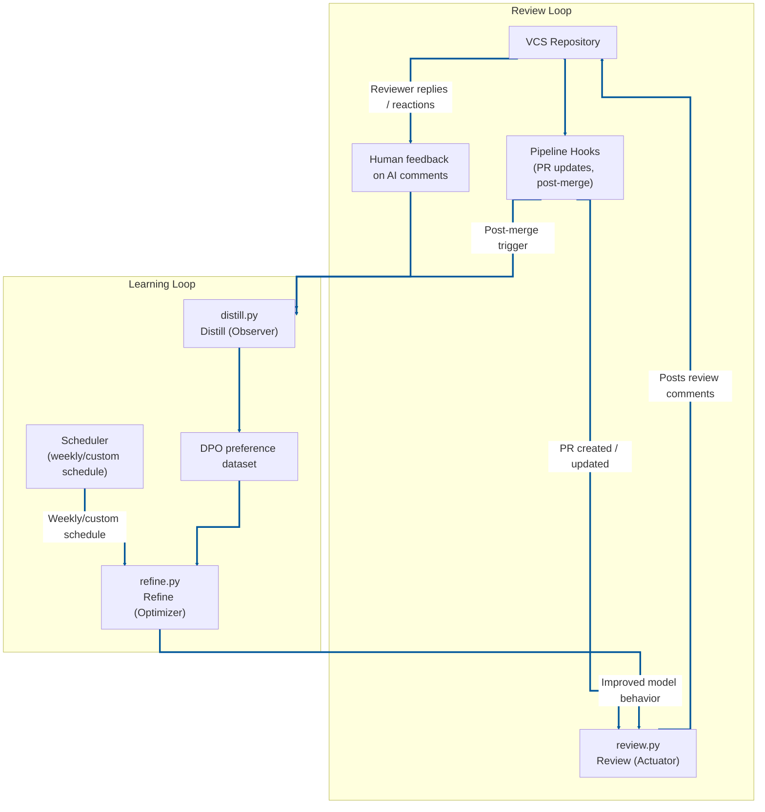

# Reflex Reviewer

Reflex Reviewer is an **automated AI code review** system for pull requests (PRs), designed with a pluggable VCS integration layer.

It runs as a self-improving loop:
- review PRs,
- collect human feedback on review comments,
- periodically refine behavior with DPO-based training signals.

Reflex Reviewer is an **agentic ecosystem** with three collaborating flows: review (actuator), distill (observer), and refine (optimizer).

## For the Nomenclature Nuts

Reflex Reviewer is named after the **Reflexion AI pattern**—an architecture where an agent evaluates outcomes and improves over time.

The name reflects a **Sense-Think-Act** cycle: continuous improvement that gets sharper with repeated feedback.

It's called **Reflex** because, like a ***human reflex***, the improvement is automatic, integrated, and gets sharper with every interaction.

## Table of Contents

- [Reflex Reviewer](#reflex-reviewer)
  - [For the Nomenclature Nuts](#for-the-nomenclature-nuts)
  - [Table of Contents](#table-of-contents)
  - [1) How it works (end-to-end)](#1-how-it-works-end-to-end)
    - [Architecture diagram](#architecture-diagram)
    - [Refinement (DPO)](#refinement-dpo)
  - [2) Reliability and retry strategy](#2-reliability-and-retry-strategy)
    - [`reflex_reviewer/vcs/bitbucket_vcs.py`](#reflex_reviewervcsbitbucket_vcspy)
    - [`reflex_reviewer/litellm_client.py`](#reflex_reviewerlitellm_clientpy)
  - [5) Runtime configuration (CLI)](#5-runtime-configuration-cli)
  - [6) VCS pipeline hooks](#6-vcs-pipeline-hooks)
    - [Bitbucket-specific reference](#bitbucket-specific-reference)
  - [7) Package-first usage (PyPI-ready)](#7-package-first-usage-pypi-ready)
    - [Install from TestPyPI (v0.1.0)](#install-from-testpypi-v010)
    - [Publish to TestPyPI with Twine](#publish-to-testpypi-with-twine)
  - [8) Local run examples](#8-local-run-examples)
  - [9) Reuse from another repository](#9-reuse-from-another-repository)
  - [10) Notes / limitations](#10-notes--limitations)
  - [11) Future improvements](#11-future-improvements)

## 1) How it works (end-to-end)

### Architecture diagram



1. **Actuation / PR Review (`reflex_reviewer/review.py`)**
   - Fetches PR diff + metadata from configured VCS provider
   - Fetches paginated PR activities/comments to reduce repetitive suggestions
   - Converts JSON diff to unified diff text, skips noisy files, truncates oversized diffs
   - Calls the configured review model and parses structured output (`verdict`, `summary`, `checklist`, `comments`)
   - For responses API mode, uses configured `stream_response`; persists and reuses `previous_response_id` by PR context when a response id is available
   - Posts summary and optional inline comments back to VCS

2. **Distillation / Feedback Collection (`reflex_reviewer/distill.py`)**
   - Reads paginated PR activities and builds root comment threads
   - Ranks threads by reply count and selects top configured threads
   - Runs one batched LiteLLM classification pass per selected threads (`ACCEPTED`, `REJECTED`, `UNSURE`) using configured `stream_response`
   - Appends only high-confidence preference samples (`ACCEPTED` / `REJECTED`) to the DPO dataset

3. **Refinement / Training (`reflex_reviewer/refine.py`)**
   - Loads DPO dataset and validates minimum sample threshold
   - Splits into train/validation sets (`train.jsonl`, `val.jsonl`) under `--dpo-training-data-dir` and starts DPO fine-tuning
   - Polls fine-tune job until terminal state
   - Clears temp cache only on successful completion

### Refinement (DPO)

**What is DPO?**

Direct Preference Optimization (DPO) is a preference-learning method that trains a model from ranked pairs (chosen vs. rejected responses), without requiring a separate reward model or a full RL optimization loop.

**Why is DPO preferred here?**

- It maps directly to Reflex Reviewer’s distilled feedback signals (`ACCEPTED` vs `REJECTED`).
- It is operationally simpler than RLHF-style training pipelines, which makes scheduled refinement easier to maintain.
- It provides targeted behavior updates from reviewer preferences while preserving the base model’s general capabilities.

**Compatibility note**

For refine/fine-tuning workflows, ensure your selected model/backend supports both fine-tuning endpoints and file upload endpoints.

---

## 2) Reliability and retry strategy

Both VCS and LiteLLM HTTP paths use `tenacity` with the same retry policy:

- `wait=wait_exponential(multiplier=1, min=2, max=20)`
- `stop=stop_after_attempt(3)`
- `retry=retry_if_exception_type(requests.exceptions.RequestException)`
- `reraise=True`

### `reflex_reviewer/vcs/bitbucket_vcs.py`

Retry-wrapped request helpers:
- `_get_with_retry(...)`
- `_post_with_retry(...)`
- `_put_with_retry(...)`

These cover Bitbucket operations such as:
- fetching PR diff,
- fetching PR metadata,
- paginated PR activity fetch,
- posting review comments,
- updating comments.

### `reflex_reviewer/litellm_client.py`

Retry-wrapped request helpers:
- `_post_with_retry(...)`
- `_get_with_retry(...)`

These cover LiteLLM operations such as:
- chat completions,
- responses API calls,
- file upload,
- fine-tune job creation,
- fine-tune status retrieval.

After retries are exhausted, request exceptions propagate to callers; response parsing failures are surfaced explicitly (`LiteLLMResponseParseError`) so callers can handle them separately.

---

## 5) Runtime configuration (CLI)

Use CLI arguments for runtime behavior. Core commands:

- `python3 -m reflex_reviewer.review`
- `python3 -m reflex_reviewer.distill`
- `python3 -m reflex_reviewer.refine`

Required CLI arguments:
- `--team-name` (all commands)
- `--dpo-training-data-dir` (required for `distill` and `refine`)

`--dpo-training-data-dir` is the parent directory for DPO datasets. The effective JSONL file is derived per team as:
- `<dpo_training_data_dir>/{sanitized_team_name}_dpo_training_data.jsonl`

Where `sanitized_team_name` is generated from `--team-name` by:
- lowercasing the team name,
- replacing non-alphanumeric separators with `_` (for example, `TEAM-DEV` → `team_dev`).

Model/runtime values can be set in `reflex_reviewer.toml` under `[model]`:
- `primary_model`
- `stream_response`
- `model_endpoint` (`chat_completions` default, or `responses` if your org/backend supports stateful `previous_response_id` flows)
- `reasoning_effort`

CLI can still override model values when needed:
- `--primary-model`
- `--stream-response`

Common optional CLI arguments:
- `--pr-id` (review/distill)
- `--vcs-type` (review/distill)
- runtime override flags for VCS and LiteLLM endpoints/credentials (for example: `--vcs-base-url`, `--litellm-base-url`, `--litellm-api-key`)

LiteLLM auth behavior:
- If `LITELLM_API_KEY` (or CLI `--litellm-api-key`) is set, LiteLLM requests use that API key.
- If no API key is provided, LiteLLM requests fall back to OAuth2 token auth.
- CLI `--litellm-api-key` takes precedence over env/TOML configuration.

For all environment variables, default values, and env interpolation behavior, refer to **`reflex_reviewer.toml`**.

---

## 6) VCS pipeline hooks

Reflex Reviewer is designed around three generic pipeline hook types:

1. **PR hook (create/update)**
   - Runs review flow:
   - `python3 -m reflex_reviewer.review --team-name "<TEAM_NAME>" --primary-model "<PRIMARY_MODEL>"`

2. **Post-merge hook (target branch updates)**
   - Runs distill flow:
   - `python3 -m reflex_reviewer.distill --team-name "<TEAM_NAME>" --primary-model "<PRIMARY_MODEL>" --dpo-training-data-dir "<TRAINING_DATA_DIR>"`

3. **Scheduled/manual hook**
   - Runs refine flow:
   - `python3 -m reflex_reviewer.refine --team-name "<TEAM_NAME>" --primary-model "<PRIMARY_MODEL>" --dpo-training-data-dir "<TRAINING_DATA_DIR>"`

### Bitbucket-specific reference

For a concrete Bitbucket implementation, see: **`bitbucket-pipelines.yml`**.

---

## 7) Package-first usage (PyPI-ready)

This repository is organized as a Python package: `reflex_reviewer`.

Build backend: this project uses **Hatchling** via `pyproject.toml`.

Published TestPyPI release (v0.1.0):
- https://test.pypi.org/project/reflex-reviewer/0.1.0/

- Install locally: `pip install -e .`

Optional package build validation:

```bash
python3 -m build
```

### Install from TestPyPI (v0.1.0)

Use TestPyPI as the primary index and PyPI as a fallback for dependencies:

```bash
pip install \
  --index-url https://test.pypi.org/simple/ \
  --extra-index-url https://pypi.org/simple/ \
  reflex-reviewer==0.1.0
```

### Publish to TestPyPI with Twine

Install packaging/publish tooling:

```bash
pip install ".[publish]"
```

Build and upload:

```bash
python3 -m build
TWINE_USERNAME=__token__ \
TWINE_PASSWORD="<TESTPYPI_TOKEN>" \
python3 -m twine upload --repository-url https://test.pypi.org/legacy/ dist/*
```

```python
import reflex_reviewer

reflex_reviewer.review(
    team_name="<TEAM_NAME>",
    primary_model="<PRIMARY_MODEL>",
)
reflex_reviewer.distill(
    team_name="<TEAM_NAME>",
    primary_model="<PRIMARY_MODEL>",
    dpo_training_data_dir="<TRAINING_DATA_DIR>",
)
reflex_reviewer.refine(
    team_name="<TEAM_NAME>",
    primary_model="<PRIMARY_MODEL>",
    dpo_training_data_dir="<TRAINING_DATA_DIR>",
)
```

Console entry points after install:
- `reflex-review`
- `reflex-distill`
- `reflex-refine`

Core components:
- **`reflex_reviewer/review.py` — Actuator**: fetches PR context, runs review, posts comments.
- **`reflex_reviewer/distill.py` — Observer**: gathers PR feedback, classifies thread sentiment, prepares training signals.
- **`reflex_reviewer/refine.py` — Optimizer**: runs DPO fine-tuning from distilled data.

VCS implementation subpackage:
- `reflex_reviewer/vcs/bitbucket_vcs.py`
- `reflex_reviewer/vcs/vcs_interface.py`

---

## 8) Local run examples

Run commands from project root (contains `pyproject.toml` and `README.md`).

Install locally:

```bash
pip install -e .
```

Optional local env bootstrap:

```bash
cp .env.example .env
```

Run review for specific PR:

```bash
python3 -m reflex_reviewer.review \
  --team-name "<TEAM_NAME>" \
  --primary-model "<PRIMARY_MODEL>" \
  --pr-id <PR_ID>
```

Run distill:

```bash
python3 -m reflex_reviewer.distill \
  --team-name "<TEAM_NAME>" \
  --primary-model "<PRIMARY_MODEL>" \
  --dpo-training-data-dir "<TRAINING_DATA_DIR>" \
  --pr-id <PR_ID>
```

Run refine:

```bash
python3 -m reflex_reviewer.refine \
  --team-name "<TEAM_NAME>" \
  --primary-model "<PRIMARY_MODEL>" \
  --dpo-training-data-dir "<TRAINING_DATA_DIR>"
```

Show CLI help:

```bash
python3 -m reflex_reviewer.review --help
python3 -m reflex_reviewer.distill --help
python3 -m reflex_reviewer.refine --help
```

---

## 9) Reuse from another repository

If you clone this repo as shared tooling in another pipeline:

```yaml
- git clone https://bitbucket.org/<workspace>/reflex-reviewer.git reflex-reviewer
- pip install -e reflex-reviewer
```

After installing packages, bootstrap your env file from `.env.example`:

```bash
cp reflex-reviewer/.env.example .env
```

Then update `.env` with your runtime values:

- VCS context: `VCS_TYPE`, `VCS_BASE_URL`, `VCS_PROJECT_KEY`, `VCS_REPO_SLUG`, `VCS_TOKEN` (and optionally `VCS_PR_ID` if you are not passing `--pr-id` via CLI).
- LiteLLM endpoint/model: `LITELLM_BASE_URL`, `PRIMARY_MODEL`.
- Auth (choose one):
  - Set `LITELLM_API_KEY`, **or**
  - Leave `LITELLM_API_KEY` empty and set `OAUTH2_TOKEN_URL`, `OAUTH2_USER_ID`, `OAUTH2_USER_SECRET`.
- Optional runtime toggles: `STREAM_RESPONSE`, `MODEL_ENDPOINT`, `LITELLM_REASONING_EFFORT`.

If your shell/pipeline does not auto-load `.env`, export it before running commands:

```bash
set -a; source .env; set +a
```

Run review:

- `python3 -m reflex_reviewer.review --vcs-type bitbucket --team-name "<TEAM_NAME>" --primary-model "<PRIMARY_MODEL>"`

Post-merge and scheduled jobs:
- `python3 -m reflex_reviewer.distill --vcs-type bitbucket --team-name "<TEAM_NAME>" --primary-model "<PRIMARY_MODEL>" --dpo-training-data-dir "<TRAINING_DATA_DIR>"`
- `python3 -m reflex_reviewer.refine --team-name "<TEAM_NAME>" --primary-model "<PRIMARY_MODEL>" --dpo-training-data-dir "<TRAINING_DATA_DIR>"`

---

## 10) Notes / limitations

- Distillation quality depends on reviewer feedback quality and thread clarity.
- `UNSURE`/ambiguous sentiment threads are skipped to protect DPO data quality.
- Very large PRs may be truncated for safety limits.
- Improvement quality depends on sustained reviewer participation.

---

## 11) Future improvements

- Add stronger sample deduplication and lineage tracking for DPO data.
- Track precision/acceptance metrics over time to quantify improvements.
- Add confidence thresholds before posting high-severity inline comments.
- Support model routing by repository/language for better specialization.
- Add additional VCS client implementations via the VCS factory.