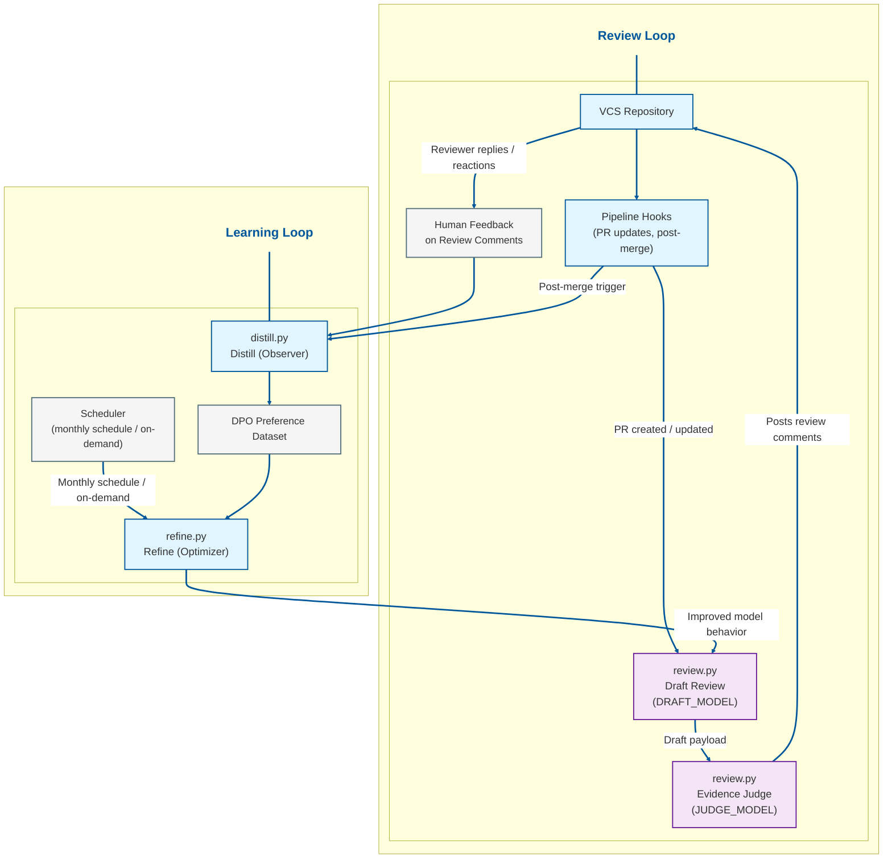
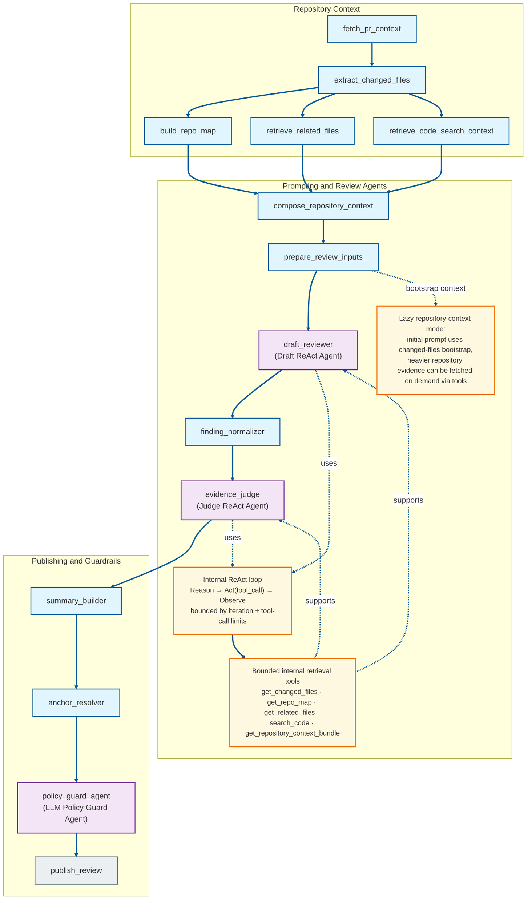

# Reflex Reviewer

Reflex Reviewer is an **automated AI code review** system for pull requests. It runs a practical improvement loop: review PRs, collect human feedback on those reviews, and refine future behavior from distilled preference signals.

> **VCS support status:** Reflex Reviewer currently supports **Bitbucket Data Center only**.  
> **GitHub support is the next target** and is not available yet.  
> **Repository-aware review context:** **Java + Python support** with parser-backed extraction (`tree-sitter` for Java, built-in `ast` for Python).

At a glance:
- **Review** analyzes a PR and posts structured feedback.
- **Distill** turns reviewer responses and discussion signals into preference data.
- **Refine** uses that data for monthly or on-demand DPO-based improvement.

## Table of Contents

- [Reflex Reviewer](#reflex-reviewer)
  - [Table of Contents](#table-of-contents)
  - [1. Overview](#1-overview)
  - [2. Architecture](#2-architecture)
    - [2.1 Architecture diagram](#21-architecture-diagram)
    - [2.2 Review flow](#22-review-flow)
    - [2.3 Review graph diagram](#23-review-graph-diagram)
    - [2.4 Distill and refine](#24-distill-and-refine)
    - [2.5 DPO in one paragraph](#25-dpo-in-one-paragraph)
  - [3. Reliability](#3-reliability)
  - [4. Configuration](#4-configuration)
  - [5. Local usage](#5-local-usage)
  - [6. CI / standalone launcher](#6-ci--standalone-launcher)
  - [7. Package usage](#7-package-usage)
    - [7.1 Install from TestPyPI](#71-install-from-testpypi)
    - [7.2 Publish to TestPyPI with Twine](#72-publish-to-testpypi-with-twine)
  - [8. Notes / limitations](#8-notes--limitations)
  - [9. Future improvements](#9-future-improvements)
  - [10. For the Nomenclature Nuts](#10-for-the-nomenclature-nuts)

## 1. Overview

Reflex Reviewer is built around a closed-loop workflow with three collaborating flows:

1. **Review** analyzes pull request changes and publishes structured feedback.
2. **Distill** converts reviewer responses and PR discussion signals into preference data.
3. **Refine** uses the accumulated preference dataset to improve future review behavior through DPO-based fine-tuning.

The review path is implementation-oriented rather than purely prompt-driven. Before any comment is published back to the VCS, the runtime combines deterministic orchestration, repository-aware context building, a draft review stage, and an evidence-checking judge stage.

## 2. Architecture

Reflex Reviewer has two main parts:
- a **graph-orchestrated review pipeline** for PR actuation, and
- a **learning loop** for distillation and refinement.

Architecture highlights:
- **Execution model**
  - **Graph-orchestrated review runtime:** deterministic stages handle context retrieval, prompt preparation, normalization, and publishing, while LLM stages handle draft and judge inference.
  - **ReAct-style bounded orchestration (repository-aware only):** draft and judge agents run internal **Reason → Act (tool call) → Observe** loops only when `REPOSITORY_PATH` resolves to a valid local repository; otherwise review uses the standard non-ReAct draft/judge path.
- **Context strategy**
  - **Context-aware zero-shot prompting:** structured prompts combine reviewer persona, review guidelines, PR metadata, diff evidence, and existing root-comment context.
  - **Hybrid repository-aware enrichment:** changed-file bootstrap context is injected early, while heavier repository evidence is retrieved lazily through bounded internal tool calls only when needed.
- **Output quality controls**
  - **Two-agent draft → judge pipeline:** a draft agent proposes findings, and a judge agent verifies and curates what can be posted.
  - **Evidence + actionability verification:** candidate comments are filtered for factual correctness, specificity, and resolvability to reduce hallucinations and improve follow-up usefulness.

### 2.1 Architecture diagram



### 2.2 Review flow

The PR review flow is orchestrated by `reflex_reviewer/review.py` through `reflex_reviewer/review_graph_runtime/graph.py`.

High-level stages:
- **Context gathering:** collect PR metadata, diff content, activities, and changed-file information.
- **Repository enrichment (hybrid):** start with lightweight changed-file bootstrap context, then retrieve heavier repository evidence lazily from `REPOSITORY_PATH` only when needed. If `REPOSITORY_PATH` is missing/invalid, repository enrichment is safely skipped and ReAct is disabled for that run.
- **Inference:** prepare prompt inputs, run `draft_reviewer`, normalize findings, and run `evidence_judge`.
- **Publishing:** build the summary, resolve anchors, run `policy_guard_agent`, and publish the review.

Repository enrichment includes:
- **Bootstrap context (eager):** include changed-file metadata early so agents can reason before expensive retrieval.
- **Repository map:** a compact structural summary of the changed files themselves (for example package/import/type/function-level information).
- **Related-file context:** deterministic snippets from nearby files inferred from imports or module relationships.
- **Bounded code-search context:** repository-wide line matches for deterministic terms derived from changed files, useful for spotting precedent, duplication, and missed follow-up updates.
- **On-demand context (lazy):** retrieve heavier evidence through bounded internal tool calls when the agent decides additional validation is needed.

Inference behavior:
- When `REPOSITORY_PATH` is valid, draft and judge agents use ReAct-style internal control loops: **Reason → Act (tool call) → Observe**, repeating until evidence is sufficient to return a final review output.
- With lazy repository context plus `review.react.require_initial_repository_tool=true`, both draft and judge default to calling at least one repository-evidence tool before finalizing when repository sections are deferred (judge side applies when `review.react.allow_judge_tool_retrieval=true`).
- When `REPOSITORY_PATH` is unset/invalid, the runtime automatically disables ReAct and executes the normal non-ReAct draft/judge flow.

Review behavior worth knowing:
- **Grounding and repetition control**
  - Existing root comment context from humans and bots is used to reduce repetitive suggestions.
  - Existing **summary comments** are excluded from root-comment feedback context so they do not influence duplicate/sentiment reasoning.
  - Same-anchor duplicate suppression is enforced in two layers:
    - judge instructions explicitly remove semantically equivalent already-covered bot comments on the same file/line,
    - `policy_guard_agent` applies final same-anchor near-duplicate filtering and reply-aware prior-comment policy before publishing.
- **Severity policy**
  - Variable/class/method naming issues are always `ADVISORY`.
  - Any comments on test files/classes are always `ADVISORY` (including Java test paths like `src/test/...` and `*Test.java`).
- **Shared context grounding**
  - The same repository context bundle is injected into both the draft and judge prompt paths.
  - Bounded code search helps ground comments in repository-wide usage patterns, reducing speculative feedback.
- **Publishing behavior**
  - Every review run posts a fresh (append-only) summary comment and may also publish inline comments.
  - Summary comments include a stable marker `<!-- reflex-reviewer-summary -->`.
  - Canonical summary shape uses three sections: `**Recommendation:**`, `**Review Summary:**`, and `**Checklist**`.
  - Recommendation display labels are user-facing: `Looks Good` or `Changes Suggested`.

### 2.3 Review graph diagram



Diagram legend:
- Purple nodes are **LLM-backed agent nodes** (`draft_reviewer`, `evidence_judge`, `policy_guard_agent`).
- Blue nodes are **deterministic orchestration, retrieval, or guardrail nodes**.
- Amber nodes annotate **internal ReAct control/tooling behavior** and **lazy repository-context bootstrap** semantics.
- Gray terminal node is the final review publication stage.

Key grouped stages:
- **Context nodes:** `fetch_pr_context`, `extract_changed_files`, `build_repo_map`, `retrieve_related_files`, `retrieve_code_search_context`
- **Inference nodes:** `compose_repository_context`, `prepare_review_inputs`, `draft_reviewer` (bounded ReAct), `finding_normalizer`, `evidence_judge` (bounded ReAct)
- **Internal ReAct retrieval tools:** `get_changed_files`, `get_repo_map`, `get_related_files`, `search_code`, `get_repository_context_bundle`
- **Lazy context behavior:** changed-files context is available at bootstrap, while heavier repository context can be deferred and fetched on demand through bounded internal tool calls.
- **Publishing nodes:** `summary_builder`, `anchor_resolver`, `policy_guard_agent`, `publish_review`

### 2.4 Distill and refine

- **Distill (`reflex_reviewer/distill.py`)** reads PR activities, reconstructs root comment threads, excludes summary comments (detected by the summary marker and canonical section shape), applies deterministic Bitbucket reaction-based sentiment overrides (for example thumbs up/down) when available, falls back to LLM thread sentiment classification as `ACCEPTED`, `REJECTED`, or `UNSURE` for unresolved threads, and appends only high-confidence accepted/rejected samples to the DPO dataset.
- **Refine (`reflex_reviewer/refine.py`)** validates dataset readiness, splits training and validation data, starts fine-tuning against the configured backend, monitors job completion, and cleans temporary cache artifacts after success.

### 2.5 DPO in one paragraph

Reflex Reviewer uses **Direct Preference Optimization (DPO)** because it maps well to distilled reviewer signals like `ACCEPTED` vs `REJECTED`, is operationally simpler than a full RLHF-style pipeline, and supports targeted behavior improvement without requiring a separate reward model.

## 3. Reliability

Both VCS and LLM API HTTP paths use retry handling via `tenacity`, but the policies are intentionally different:
- **VCS calls** use a shorter retry window for transient request failures.
- **LLM API calls** use a slower retry window and honor `Retry-After` on HTTP `429` when available.

After retry exhaustion, request exceptions are surfaced to callers. Response parsing failures are raised explicitly as `LLMAPIResponseParseError` so they can be handled separately.

## 4. Configuration

Use CLI arguments for runtime behavior. Core commands are:
- `python3 -m reflex_reviewer.review`
- `python3 -m reflex_reviewer.distill`
- `python3 -m reflex_reviewer.refine`

Important CLI arguments:
- `--team-name` for all commands
- `--dpo-training-data-dir` for `distill` and `refine`
- `--pr-id` for `review` and `distill`
- `--draft-model`, `--judge-model`, and `--stream-response` when you want to override model settings

Configuration sources are intended to work together:
- CLI overrides
- environment variables
- `reflex_reviewer.toml`

Important settings in `reflex_reviewer.toml`:
- `[model]`
  - `draft_model`
  - `judge_model`
  - `stream_response`
  - `model_endpoint`
  - `reasoning_effort`
- `[llm_api]`
  - `read_timeout_seconds`
- `[review]`
  - `test_file_path_markers` (default includes `tests`, `src/test`)
  - `test_file_name_prefixes` (default includes `test_`)
  - `test_file_name_suffixes` (default includes Python and Java test naming patterns such as `_test.py`, `*Test.java`, `*IntegrationTests.java`)
- `[review.repository_context]`
  - `repository_path`
  - `ignore_directories` (env-backed via `REPOSITORY_IGNORE_DIRECTORIES`; values are added to built-in default ignore directories)
  - `max_changed_files` (default: `400`)
  - `max_repo_map_files` (default: `150`)
  - `max_repo_map_chars` (default: `100000`)
  - `max_related_files` (default: `80`)
  - `max_related_files_chars` (default: `150000`)
  - `max_code_search_results` (default: `500`)
  - `max_code_search_chars` (default: `150000`)
  - `max_code_search_query_terms` (default: `50`)
- `[review.react]`
  - `enabled` (default: `true`)
  - `max_draft_iterations` (default: `4`)
  - `max_judge_iterations` (default: `3`)
  - `max_tool_calls_per_agent` (default: `8`)
  - `max_tool_result_chars` (default: `12000`)
  - `default_include_changed_files` (default: `true`)
  - `require_initial_repository_tool` (default: `true`)
  - `allow_judge_tool_retrieval` (default: `true`)
  - `lazy_repository_context` (default: `true`)

Important behavior notes:
- `--dpo-training-data-dir` is the parent directory for team-specific DPO datasets.
- `LLM_API_KEY` enables direct API-key auth; otherwise runtime falls back to OAuth2 token auth.
- `LLM_API_READ_TIMEOUT_SECONDS` can override the TOML socket read timeout.
- `REPOSITORY_PATH` points repository-aware review at a local checkout; if unset or invalid, review safely continues with PR context only and ReAct is automatically disabled.
- `REPOSITORY_IGNORE_DIRECTORIES` adds comma-separated directory names to exclude during repository code-search scanning, in addition to built-in default ignore directories.
- ReAct mode is repository-aware: it runs only when `REPOSITORY_PATH` is valid, uses a changed-files bootstrap context by default, and retrieves heavier repository context lazily through bounded internal tool calls.
- When `review.react.require_initial_repository_tool=true` and lazy repository context is active, draft and judge ReAct must make at least one repository-evidence tool call (`get_repo_map`, `get_related_files`, `search_code`, or `get_repository_context_bundle`) before finalizing when repository context is deferred; judge enforcement applies only when `review.react.allow_judge_tool_retrieval=true`.

To enable repository-aware review context in practice, export `REPOSITORY_PATH` to the checked-out repository you want Reflex Reviewer to inspect. Example:

```bash
export REPOSITORY_PATH="/absolute/path/to/checked-out-repository"
```

Without `REPOSITORY_PATH`, review still runs, but repository map, related-file retrieval, and bounded code-search enrichment are skipped, and ReAct loops are not used.

Repository-aware context defaults are intentionally configurable and now tuned for larger context-window backends. If your runtime has strict latency or token-cost limits, lower `[review.repository_context]` char/result caps in `reflex_reviewer.toml`.

For the complete list of environment variables, defaults, and env interpolation behavior, refer to **`reflex_reviewer.toml`**.

## 5. Local usage

Run commands from the project root (the directory containing `pyproject.toml` and `README.md`).

Install locally:

```bash
pip install .
```

Recommended local unit test bootstrap:

```bash
python3 -m venv .venv
.venv/bin/python -m pip install -r requirements.txt -e ".[test]"
```

Run unit tests:

```bash
.venv/bin/python -m unittest discover -s tests
.venv/bin/python -m unittest discover -s standalone_launcher/tests
```

Optional local env bootstrap:

```bash
cp .env.example .env
```

Run review for a specific PR:

```bash
python3 -m reflex_reviewer.review \
  --team-name "<TEAM_NAME>" \
  --draft-model "<DRAFT_MODEL>" \
  --judge-model "<JUDGE_MODEL>" \
  --pr-id <PR_ID>
```

Run distill:

```bash
python3 -m reflex_reviewer.distill \
  --team-name "<TEAM_NAME>" \
  --draft-model "<DRAFT_MODEL>" \
  --dpo-training-data-dir "<TRAINING_DATA_DIR>" \
  --pr-id <PR_ID>
```

Run refine:

```bash
python3 -m reflex_reviewer.refine \
  --team-name "<TEAM_NAME>" \
  --draft-model "<DRAFT_MODEL>" \
  --dpo-training-data-dir "<TRAINING_DATA_DIR>"
```

Show CLI help:

```bash
python3 -m reflex_reviewer.review --help
python3 -m reflex_reviewer.distill --help
python3 -m reflex_reviewer.refine --help
```

Get an OAuth2 access token directly (prints the token to stdout):

```bash
python3 -m reflex_reviewer.auth.oauth2
```

## 6. CI / standalone launcher

For CI or pipeline usage, use a single entrypoint:

- `python3 reflex_reviewer_launcher.py`

Flow selection is env-driven:
- `RR_LAUNCHER_COMMAND=review|distill|refine`
- `RR_LAUNCHER_ARGS='...'` for optional passthrough args
- `PR_ID` is the normal PR identifier source for `review` and `distill`

Copy these two files into your pipeline workspace:
- `standalone_launcher/reflex_reviewer_launcher.py`
- `standalone_launcher/reflex_reviewer_bootstrap.py`

Launcher behavior:
- reuses an existing runner venv when bootstrap inputs match and the venv is healthy,
- rebuilds the venv when it is missing, broken, inputs changed, or `RR_FORCE_REBUILD_VENV` is enabled,
- installs required package dependencies during rebuild,
- runs the selected flow command with the resolved interpreter.

Required environment variables:
- **All flows**
  - `TEAM_NAME`
  - `DRAFT_MODEL`
  - `LLM_API_BASE_URL`
- **Review + distill**
  - `VCS_BASE_URL`
  - `VCS_PROJECT_KEY`
  - `VCS_REPO_SLUG`
  - `VCS_TOKEN`
- **Review only**
  - `JUDGE_MODEL`
- **Distill + refine**
  - `DPO_TRAINING_DATA_DIR`

LLM auth options:
- `LLM_API_KEY`, or
- `OAUTH2_TOKEN_URL` + `OAUTH2_USER_ID` + `OAUTH2_USER_SECRET`

Useful optional variables:
- `LLM_API_PROXY_URL`
- `REPOSITORY_PATH` (local checkout path used for repository-aware review context)
- `REPOSITORY_IGNORE_DIRECTORIES` (optional comma-separated additional ignore directories for repository code search)
- `PYTHON_BIN`
- `RR_RUNNER_VENV_DIR`
- `RR_PACKAGE_INSTALL_TARGET`
- `RR_PACKAGE_INDEX_URL`
- `RR_PACKAGE_EXTRA_INDEX_URL`
- `RR_FORCE_REBUILD_VENV`

To enable repository-aware review in CI/launcher runs, set `REPOSITORY_PATH` to the checked-out repository path used by your job. Optionally set `REPOSITORY_IGNORE_DIRECTORIES` to add extra directories to skip during repository code-search scanning.

Example:

```bash
export TEAM_NAME="<TEAM_NAME>"
export DRAFT_MODEL="<DRAFT_MODEL>"
export JUDGE_MODEL="<JUDGE_MODEL>"
export LLM_API_BASE_URL="<LLM_API_BASE_URL>"

export VCS_BASE_URL="<VCS_BASE_URL>"
export VCS_PROJECT_KEY="<VCS_PROJECT_KEY>"
export VCS_REPO_SLUG="<VCS_REPO_SLUG>"
export VCS_TOKEN="<VCS_TOKEN>"

# Repository-aware review context (optional)
export REPOSITORY_PATH="/absolute/path/to/checked-out-repository"
export REPOSITORY_IGNORE_DIRECTORIES="target,build,.cache"

export LLM_API_KEY="<LLM_API_KEY>"
export PR_ID="123"
RR_LAUNCHER_COMMAND=review python3 reflex_reviewer_launcher.py

export DPO_TRAINING_DATA_DIR="data"
RR_LAUNCHER_COMMAND=distill python3 reflex_reviewer_launcher.py
RR_LAUNCHER_COMMAND=refine python3 reflex_reviewer_launcher.py
```

## 7. Package usage

This repository is organized as a Python package: `reflex_reviewer`. The build backend is **Hatchling**, configured through `pyproject.toml`.

Published TestPyPI release:
- https://test.pypi.org/project/reflex-reviewer/

Install locally:

```bash
pip install .
```

Optional wheel build validation:

```bash
python3 -m build --wheel
```

### 7.1 Install from TestPyPI

```bash
pip install \
  --index-url https://test.pypi.org/simple/ \
  --extra-index-url https://pypi.org/simple/ \
  reflex-reviewer
```

Console entry points after install:
- `reflex-review`
- `reflex-distill`
- `reflex-refine`

Optional Python API usage:

```python
import reflex_reviewer

reflex_reviewer.review(
    team_name="<TEAM_NAME>",
    draft_model="<DRAFT_MODEL>",
    judge_model="<JUDGE_MODEL>",
)

reflex_reviewer.distill(
    team_name="<TEAM_NAME>",
    draft_model="<DRAFT_MODEL>",
    dpo_training_data_dir="<TRAINING_DATA_DIR>",
)

reflex_reviewer.refine(
    team_name="<TEAM_NAME>",
    draft_model="<DRAFT_MODEL>",
    dpo_training_data_dir="<TRAINING_DATA_DIR>",
)
```

### 7.2 Publish to TestPyPI with Twine

```bash
pip install ".[publish]"
python3 -m build --wheel
TWINE_USERNAME=__token__ \
TWINE_PASSWORD="<TESTPYPI_TOKEN>" \
python3 -m twine upload --repository-url https://test.pypi.org/legacy/ dist/*.whl
```

## 8. Notes / limitations

- Current VCS integration support is limited to **Bitbucket Data Center**.
- **GitHub support is planned next** and is not yet implemented.
- Distillation quality depends on reviewer feedback quality and thread clarity.
- `UNSURE` or ambiguous sentiment threads are skipped to protect DPO data quality.
- Very large PRs may be truncated for safety limits.
- Improvement quality depends on sustained reviewer participation.

## 9. Future improvements

- **Phase 1:** Add vector-database-backed preference memory from distilled DPO/comment-thread outcomes, persist accepted/rejected/unresolved metadata, and expose backend-ready stats for future dashboard/reporting flows.
- **Phase 2:** Use that vector preference memory as a review-time knowledge base to retrieve historically accepted/rejected exemplars and inject bounded preference guidance into review prompts while keeping judge-stage evidence validation authoritative.
- Add **large-PR chunked review orchestration** so Reflex Reviewer can split very large pull requests into multiple draft-model review passes while preserving prior chunk context through explicit structured rolling memory and deterministic finding merge before final judging.
- Add **GitHub** as the next supported VCS provider.
- Expand **repository-aware review context** beyond the current Java/Python adapter implementation.
- Improve **DPO data quality and observability**, including deduplication, lineage tracking, and acceptance metrics.
- Support model routing by repository or language.
- Add more VCS client implementations through the VCS factory.

## 10. For the Nomenclature Nuts

Reflex Reviewer is named after the **Reflexion AI pattern**: an approach where an agent evaluates outcomes and improves over time.

The name reflects a **Sense-Think-Act** cycle and the idea that improvement becomes more automatic and sharper with repeated feedback.
